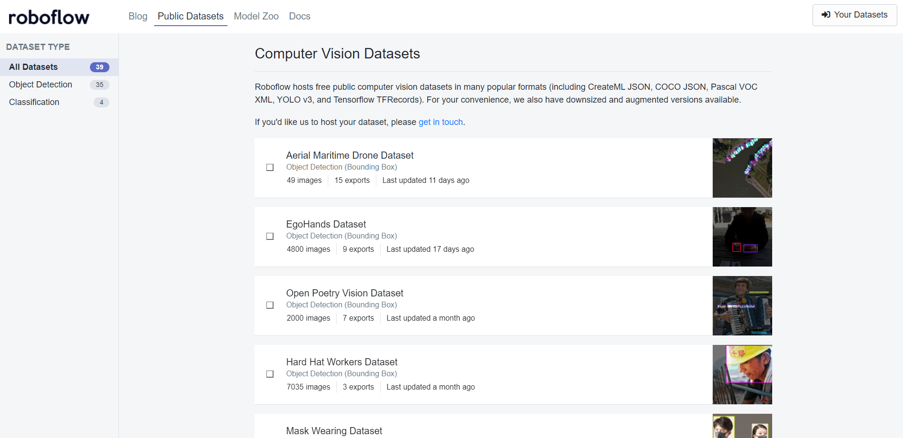
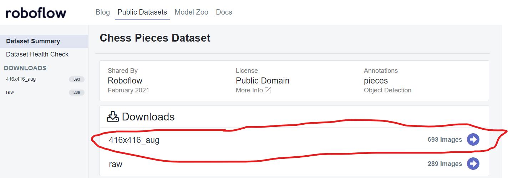
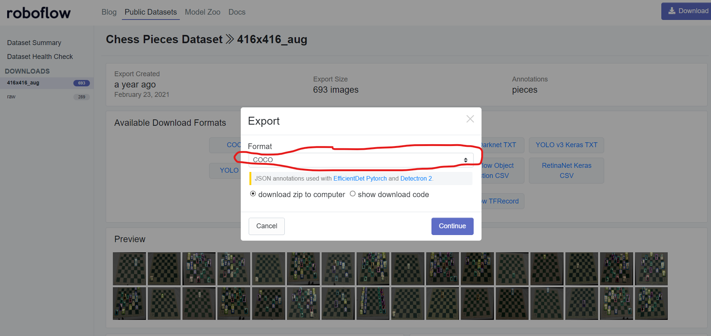

# Ready to use datasets

## Great for learning
For learning purposes, you usually need datasets consisting of just several dozen of images up to a few thousand. Usually a few houndred is enough for an exercise.

There are two places wit great resourses for that (both require creating account):
- [Roboflow](https://public.roboflow.com/object-detection)
- [Kaggle](https://www.kaggle.com/datasets?search=object+detection)

### Kaggle

In Kaggle, each dataset in organized by its author. In order to avoid extra work to parse non-standard annotation you may look for dataset in one of the common formats: COCO, YOLO, Pascal VOC, such as [African wildlife](https://www.kaggle.com/datasets/biancaferreira/african-wildlife)(YOLO), [fruit](https://www.kaggle.com/datasets/mbkinaci/fruit-images-for-object-detect)(Pascal VOC),  [tomato](https://www.kaggle.com/datasets/andrewmvd/tomato-detection)(Pascal VOC) or [reatil products](https://www.kaggle.com/datasets/diyer22/retail-product-checkout-dataset)

### Roboflow step by setep (05.2022)

In the website you can browse the datasets (step 1). After clicking your favourite(this tutorial uses https://public.roboflow.com/object-detection/chess-full)
you can choose among versions, usually with raw either preprocessed (augmented, padded) images (step 2).
After that, you get a pup-up with dataset format selection (step 3). This tutorial works with COCO or YOLOv5.

Step 1: dataset selection

Step 2: dataset version selection

Step 3: annotation format selection

## Benchmark datasets:
Object detections models are trained and evaluated on large benchmark datasets.
The most popular are:
- COCO (Common Objects in Context) https://cocodataset.org/ (91 categories, 2,500,000 instances)
- PASCAL VOC http://host.robots.ox.ac.uk/pascal/VOC/voc2012/ (20 categories, 500,000 instances)

For fine-tuning, you will likely use models weights trained on one of these.
Comparison of performence of different detection models for these and other benchmarks: https://paperswithcode.com/task/object-detection

## Other datasets:
- https://seadronessee.cs.uni-tuebingen.de
- https://www.crowdhuman.org
